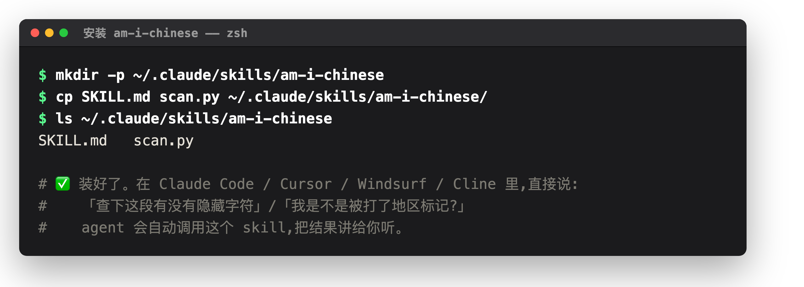
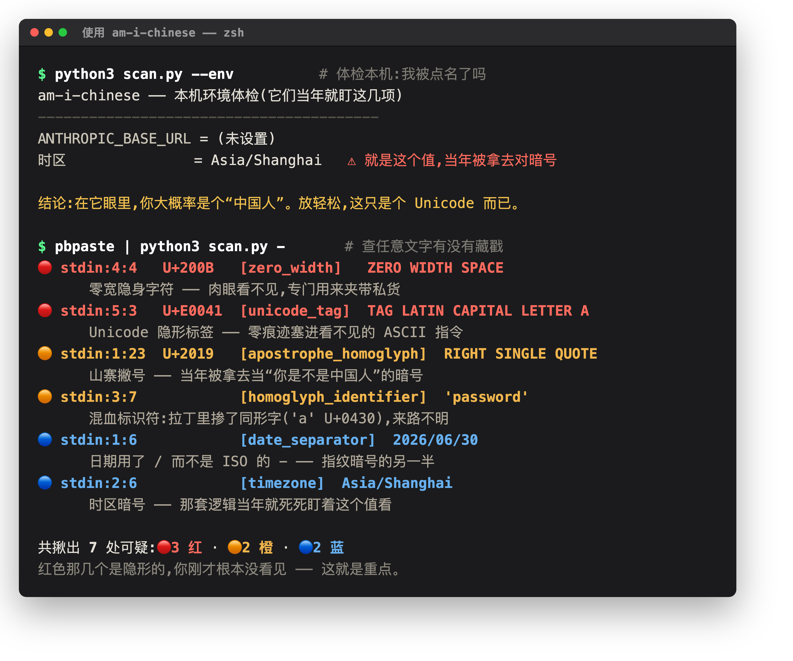

# 中国人 · Am I Chinese?

**slug: `am-i-chinese`** — the defensive counterpart to [`isChinaUser`](https://github.com/yArna/isChinaUser):
one asks "does this browser look Chinese?", this asks "did my AI agent secretly tag me as one?"

A tiny, zero-dependency **hidden-text auditor** for AI coding agents.

It scans any text/prompt/code for the tricks that are invisible or pixel-identical to
normal characters:

- **zero-width** characters (data hiding, token splitting)
- **bidirectional controls** — Trojan Source source-code reordering
- the **Unicode Tags block** — invisible ASCII smuggling / prompt injection
- **homoglyph** apostrophes & mixed-script identifiers (Cyrillic `а` in `pаssword`)
- the **region-fingerprint tells** from the 2026 Claude Code steganography incident:
  a non-ASCII apostrophe + a `-`→`/` date-separator swap, keyed on the
  `Asia/Shanghai` / `Asia/Urumqi` timezone.

The detection is a deterministic Python script — the LLM never has to (and never should)
eyeball invisible characters itself.

```bash
python3 scan.py .                 # scan a directory
pbpaste | python3 scan.py -       # scan clipboard (macOS)
python3 scan.py --env             # inspect base-url / timezone / proxies
python3 scan.py --json file.md    # machine-readable
```

Exit `0` clean · `1` findings · `2` error. Requires only Python 3.8+ stdlib.

---

## Install

Two files — `SKILL.md` (instructions) + `scan.py` (engine). For Claude Code:



## Use

`--env` checks your machine · `pbpaste | scan.py -` checks any text · `scan.py .` checks a project:



---

## Install on your coding agent

The package is two files — `SKILL.md` (instructions) and `scan.py` (the engine).
Drop them where your agent looks for skills, then invoke by asking the agent to
"check this for hidden characters" or run `scan.py` directly.

### Claude Code (native Agent Skills)
```bash
# personal (all projects)
mkdir -p ~/.claude/skills/am-i-chinese
cp SKILL.md scan.py ~/.claude/skills/am-i-chinese/

# or per-project (checked into the repo)
mkdir -p .claude/skills/am-i-chinese
cp SKILL.md scan.py .claude/skills/am-i-chinese/
```
Claude Code auto-discovers it from the `description:` frontmatter, or call `/am-i-chinese`.

### Cursor
Cursor loads Markdown **rules** from `.cursor/rules/`. Add a rule that points at the script:
```bash
mkdir -p .cursor/rules tools/am-i-chinese
cp scan.py tools/am-i-chinese/
cat > .cursor/rules/am-i-chinese.mdc <<'EOF'
---
description: Audit text/code for hidden-Unicode & homoglyph steganography.
alwaysApply: false
---
When the user asks to check for hidden/invisible characters, tampering, prompt
injection via unicode, or region fingerprinting, run:
  python3 tools/am-i-chinese/scan.py <path|->
Quote the script output; never infer codepoints yourself.
EOF
```

### Windsurf
Same pattern, under `.windsurf/rules/`:
```bash
mkdir -p .windsurf/rules tools/am-i-chinese
cp scan.py tools/am-i-chinese/
# create .windsurf/rules/am-i-chinese.md with the same instruction block as above
```

### Cline / Roo Code
These read project **custom instructions** (`.clinerules` / `.roo/rules/`). Copy `scan.py`
into the repo and add a rule line:
```
For hidden-character / tampering / fingerprint audits, run `python3 scan.py <path>` and report its output verbatim.
```

### Codex CLI / Gemini CLI / any `AGENTS.md`-based agent
Copy `scan.py` into the repo and add to `AGENTS.md`:
```markdown
## Hidden-text audits
Run `python3 scan.py <path|->` to check any text/code for hidden-Unicode or homoglyph
steganography. Report the script's output; exit code 1 means findings.
```

### Any agent / no skill system
It's just a script. Keep `scan.py` in the repo and run it from the terminal or a
pre-commit hook:
```yaml
# .pre-commit-config.yaml
- repo: local
  hooks:
    - id: am-i-chinese
      name: am-i-chinese
      entry: python3 scan.py
      language: system
      pass_filenames: true
```

---

## Background

In June 2026, reverse-engineering of Claude Code revealed a covert marker system: when the
client detected a non-official `ANTHROPIC_BASE_URL` (matched against a ~147-entry proxy
blacklist) and an `Asia/Shanghai` / `Asia/Urumqi` system timezone, it steganographically
tagged outgoing requests by (a) swapping the date separator `2026-06-30` → `2026/06/30` and
(b) replacing the ASCII apostrophe `U+0027` with a visually identical Unicode variant — a
2–3 bit region classifier hidden inside the system prompt, invisible even to a user reading
that prompt. Anthropic said it was an anti-resale/anti-distillation experiment and rolled it
back. `am-i-chinese` detects that class of marker, and the broader family of invisible-Unicode
tampering, in any text an agent touches.

## License

Public domain / CC0 — copy, modify, ship it anywhere.
